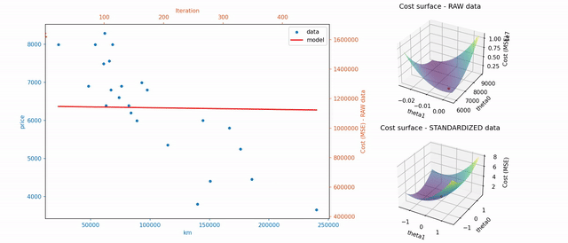

# ft_linear_regression



Try the Streamlit application here: https://ft-linear-regression.streamlit.app/
(for a better video quality)

## Introduction

This project is an introduction to machine learning. The main goal is to implement a simple linear regression to predict a car's price based on its mileage using the gradient descent algorithm.

## The project has two main programs:

train: reads a CSV file, computes the parameters theta0 and theta1 via gradient descent, and saves the model.

predict: uses the trained model to estimate the price of a car for a given mileage.

## Implemented bonuses

Training visualization: animation showing the evolution of theta0 and theta1 and the decrease in error.

Interactive graphs (clone the repo to move them): regression line displayed on both raw and standardized data.

Performance metrics calculation: MSE, MAE, RMSE, and R² are stored in the model file.

## Local installation & usage

Clone the repository

```cd ft_linear_regression```

### First step: train

```./run.sh train```

or

```./run.sh train --bonus```

You also can input another specific csv file (2 numerical columns) with:

```./run.sh train --bonus --file yourdatafile.csv```

### Second step: predict

```./run.sh train 650000```

or

```./run.sh train 65000 --bonus```

(a km value is mandatory)
